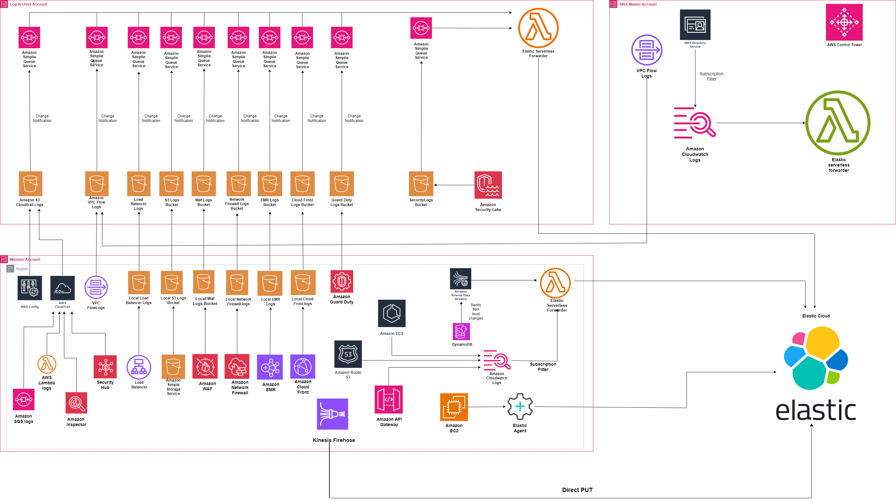
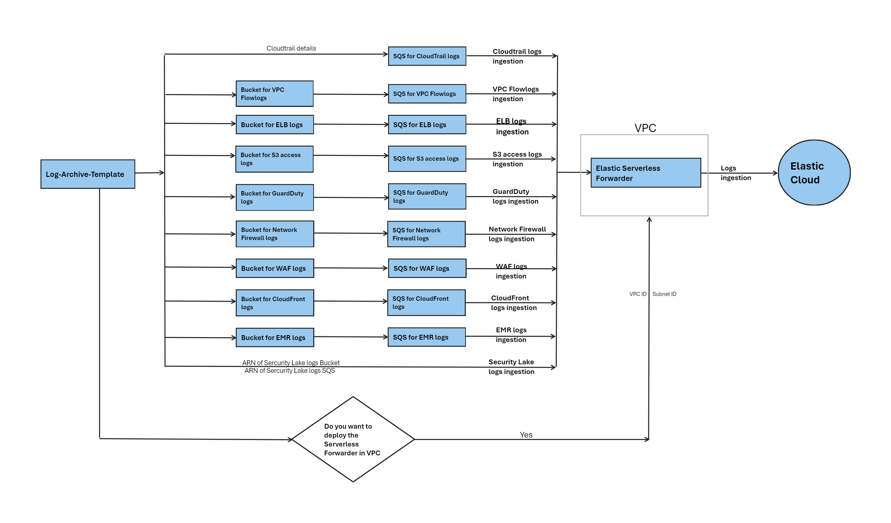
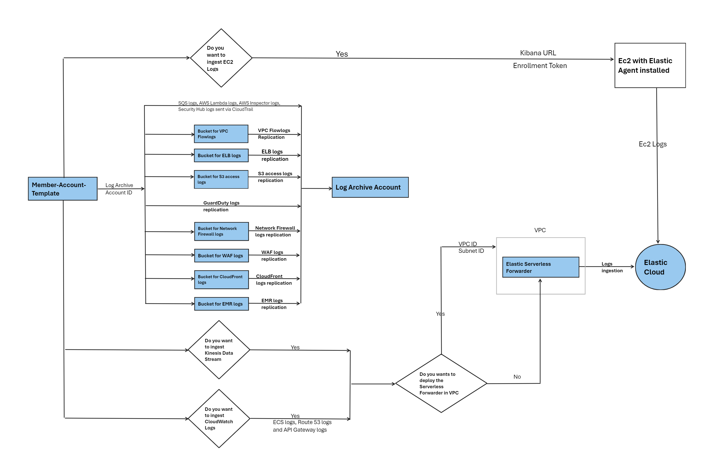
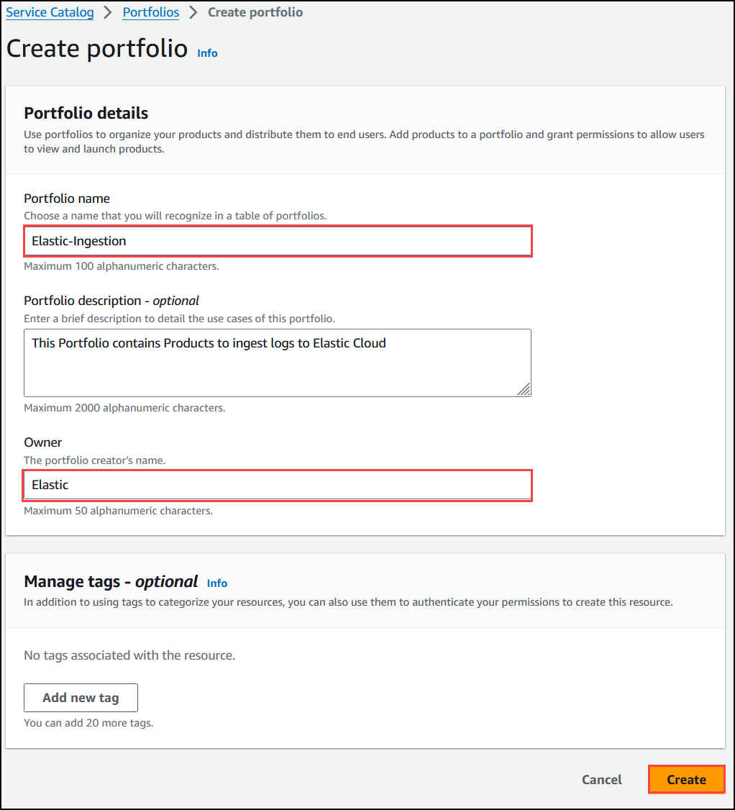
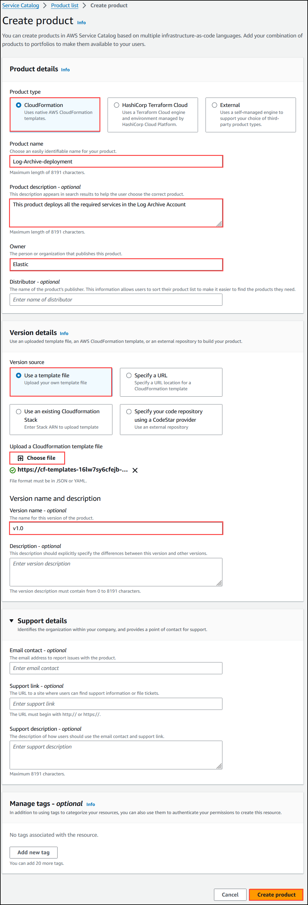
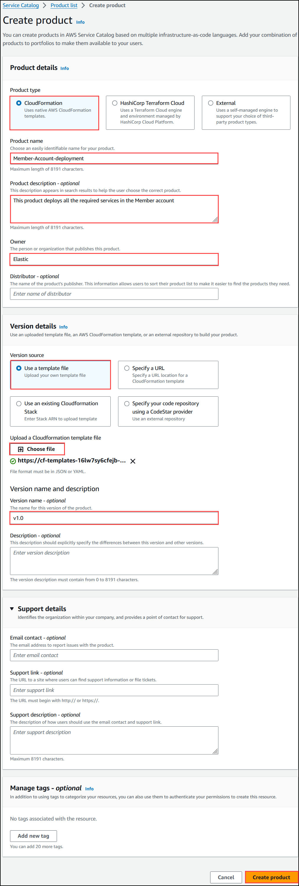
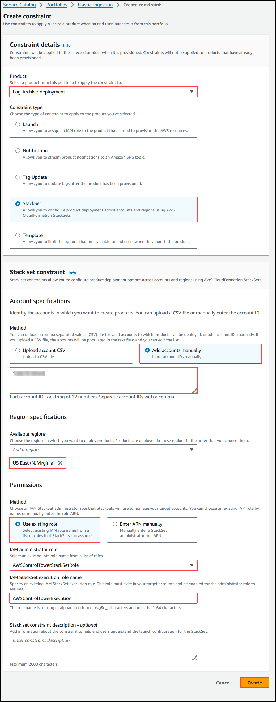
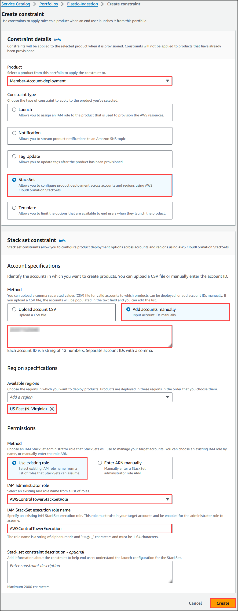

# Elastic-ingest-accelerator

<!-- TOC -->

1. [Solution Overview](#solution-overview)
2. [Architecture](#architecture)
3. [Prerequisites](#prerequisites)
4. [AWS Control Tower Overview](#aws-control-tower-overview)
5. [Deployment Overview](#deployment-overview)
6. [How Each Log Input is Collected and Sent to Elastic](#how-each-log-input-is-collected-and-sent-to-elastic)
7. [Deployment Flow](#deployment-flow)
8. [Technical details](#technical-details)
9. [Deployment Steps](#deployment-steps)

<!-- /TOC -->

## Solution Overview

This guide shows how Amazon Web Services (AWS) logs can be collected into a central account in AWS and sent to Elastic. Elastic is the leading platform for search-powered solutions, and help everyone — organizations, their employees, and their customers — find what they need faster, while keeping applications running smoothly, and protecting against cyber threats.

## Architecture

The following architecture diagram outlines high-level components involved in ingesting logs from various AWS Services to Elastic Cloud.

1. Master Account: The AWS Master account will be primarily used as a deployment entry point for solution, AWS Control Tower management and to host Elastic forwarder for AWS Directory services-related logs, if enabled.
2. Log Archive Account: This account will be primarily used to store the logs in various S3 buckets through control tower integration, it will also host the primary Elastic Serverless forwarder and SQS to notify the logs from S3 buckets into Elastic Cloud.
3. Member Account(s): One or more member accounts may contain AWS resources, sending logs to the log-archive account. Member accounts may also host the Elastic serverless forwarder for Kinesis data stream/cloud watch logs ingestion to Elastic Cloud if required.



## Prerequisites

- You need to set up the Control Tower in the AWS master account. This will set up the Log Archive account and deploy the CloudTrail. Please refer to the [AWS Control Tower Documentation](https://docs.aws.amazon.com/controltower/latest/userguide/what-is-control-tower.html) and [Getting started with AWS Control Tower](https://docs.aws.amazon.com/controltower/latest/userguide/getting-started-with-control-tower.html).
- After the Service catalog is deployed, the logs of the resources mentioned below in the document will be ingested to the Elastic Cloud, please make sure you have the right configurations for these resources to ingest the logs
- The forwarder Lambda function that creates the config.yaml file for Elastic Serverless Forwarder is written in Python, and requires a set of node modules. These required scripts and packages are zipped and uploaded in the src folder. Download the zip file **ElasticBootstrapLambdaLogArchiveAccount** from the folder log-archive-account in src and the zip file **ElasticBootstrapLambdaMemberAccount** from the folder member-account in src. Create S3 bucket in the region where you want to deploy the service catalog and upload these zip files in the bucket. The zip files need to have the following bucket policy so they can be shared with the organization and accessed by the forwarder Lambda function deployment. Please refer to the sample code below and provide the arn of the S3 bucket and the organization ID as required:

  ```
  {
     "Version": "2012-10-17",
     "Statement": [
     {
         "Sid": "AllowGetObject",
         "Effect": "Allow",
         "Principal": {
             "AWS": "*"
         },
         "Action": "s3:GetObject",
         "Resource": "arn:aws:s3::: s3-bucket-name/*",
         "Condition": {
             "StringEquals": {
                 "aws:PrincipalOrgID": "org-id "
             }
         }
      }
     ]
  }
  ```
  
- If you want to deploy Elastic Serverless forwarder in Amazon VPC, then you need to create the required VPC, subnets, and route tables in the account you are deploying the Service Catalog product.
- You must have an Elastic Cluster, Elastic Cloud ID, and Elastic API key to ingest the logs to the Elastic Cloud.

## AWS Control Tower Overview

AWS Control Tower simplifies the process of setting up and governing a secure, multi-account AWS environment based on AWS best practices. It is particularly useful for organizations that require a scalable and standardized approach to managing multiple AWS accounts.

### Key features and components of AWS Control Tower include:

#### AWS Landing Zone:

- The Landing Zone is the foundation of the multi-account AWS environment created by AWS Control Tower.
- It includes a set of best-practice blueprints and guidelines for setting up a secure, well-architected environment.

For the latest and more information, refer to the [AWS Landing Zone](https://docs.aws.amazon.com/prescriptive-guidance/latest/migration-aws-environment/understanding-landing-zones.html).

#### Account Vending:

- AWS Control Tower automates the creation of new AWS accounts using predefined account blueprints.
- It ensures that new accounts adhere to organizational policies and best practices.

For the latest and more information, to refer to the [Account Factory](https://docs.aws.amazon.com/controltower/latest/userguide/account-factory.html).

#### Multi-account Architecture:

- It enables the creation and management of a multi-account structure, which is recommended for security and resource isolation.
- AWS Control Tower creates Log Archive and Audit Account which plays a crucial role in maintaining visibility and compliance across the AWS environment.
- The multi-account setup includes a master account and separate member accounts.

For the latest and more information, to refer to the [Multi Account Setup](https://docs.aws.amazon.com/controltower/latest/userguide/aws-multi-account-landing-zone.html).

#### Guardrails:

- Guardrails are a set of predefined policies that are enforced automatically to ensure compliance with security and operational best practices.
- AWS Control Tower implements guardrails to help prevent policy violations in member accounts.

For the latest and more information, to refer to the [Controls](https://docs.aws.amazon.com/wellarchitected/latest/management-and-governance-guide/controls.html).

#### Service Control Policies (SCPs):

- SCPs are used to set fine-grained permissions on AWS accounts within the organization.
- SCPs can be used to control access to AWS services and resources, ensuring compliance with organizational policies.

For the latest and more information, to refer to the [SCPs](https://docs.aws.amazon.com/organizations/latest/userguide/orgs_manage_policies_scps.html).

#### Audit and Monitoring:

- AWS Control Tower provides visibility into the compliance status of member accounts.
- It involves monitoring the performance and health of resources, as well as conducting audits to ensure compliance with security policies and industry regulations.

For the latest and more information, to refer to the [Logging & Monitoring](https://docs.aws.amazon.com/controltower/latest/userguide/logging-and-monitoring.html).

#### Continuous Improvement:

- AWS Control Tower supports continuous improvement by allowing organizations to update and refine their account blueprints and guardrails over time.
- This ensures that the environment stays in compliance with evolving security and operational requirements. 

#### Integration with AWS Organizations: 

- AWS Control Tower integrates with AWS Organizations, making it easier to manage and govern a growing number of AWS accounts.

For the latest and more information, to refer to the [AWS Organization](https://docs.aws.amazon.com/organizations/latest/userguide/services-that-can-integrate-CTower.html).

#### Log Archive Account: 

- The Log Archive account is a dedicated AWS account created by AWS Control Tower to centralize and store logs generated by member accounts.
- It serves as a centralized location for storing security and operational logs, ensuring long-term retention and easy access.

#### Audit Account:

- It serves as a centralized location for conducting audits, security assessments, and compliance checks across the AWS environment.

## Deployment Overview

The service catalog must be deployed to the Log Archive account and the customer member accounts which are part of the AWS Organization so it can collect logs accordingly. We have considered the following inputs for log ingestion 

- AWS CloudTrail logs
- Amazon S3 Access logs
- Amazon ELB logs
- Amazon VPC Flow logs
- AWS Kinesis Data Stream
- AWS CloudWatch logs
- AWS GuardDuty logs
- Amazon Ec2 logs
- AWS Network Firewall logs
- Amazon WAF logs
- Amazon CloudFront logs
- Amazon EMR Cluster logs
- Amazon Security Lake logs
- AWS SQS Management Event logs via CloudTrail
- AWS Lambda logs via CloudTrail
- AWS Inspector logs via CloudTrail
- Security Hub logs via CloudTrail
- Amazon Elastic Container Service logs via CloudWatch
- Amazon Route 53 logs via CloudWatch
- Amazon API Gateway logs via CloudWatch


The service catalog will be deploying the solution as per the resources deployed in the member account and user requirements of the logs that are to be ingested into the Elastic Cloud. The CFT will deploy resources in the Log-Archive account and then another CFT will deploy the required resources in the member account. Please note that the deployment of the CFT should be initiated from the Master account and all the required resources will be deployed to the Log Archive account and the member account using the CloudFormation Stackset.

## How Each Log Input is Collected and Sent to Elastic

### AWS CloudTrail  

AWS Control Tower collects CloudTrail logs from all accounts and all AWS Regions and stores the log data in a central S3 bucket in Log-Archive. Elastic pulls these logs using an SQS-based S3 input mechanism. New object notifications are sent to SQS. Elastic polls the queue to discover new log items, then ingests them from the S3 bucket.

### S3 Access Logs

S3 access logs are collected locally in each region in each member account and replicated to the central S3 log bucket in the Log-Archive account. The logs from the S3 bucket in the log archive account are sent to the Elastic Serverless forwarder via the SQS.

### Amazon ELB logs

ELB logs are collected locally in each Region in each member account and replicated to the central S3 log bucket in the Log-Archive account. The logs from the S3 bucket in the log archive account are sent to the Elastic Serverless forwarder via the SQS.

### Amazon VPC Flow logs

Amazon VPC Flow logs can be sent directly to the central S3 log bucket in the Log Archive account. Amazon VPC Flow logs generate a lot of log data, so we don’t recommend that you generate them from each account and each region. GuardDuty analyzes Amazon VPC Flow logs to create findings. The logs from the S3 bucket in the log archive account are sent to the Elastic Serverless forwarder via the SQS.

### AWS Kinesis Data Stream

The item level changes in the DynamoDB are sent to Amazon Kinesis Data Stream. The Kinesis Data Stream’s ARN is provided to the Elastic Serverless Forwarder. Elastic Serverless Forwarder, an AWS Lambda function facilitating the transfer of data from Kinesis Data Stream to Elastic Cloud.

### AWS CloudWatch logs

CloudWatch logs are subscribed by a subscriber Lambda function and sent to a Elastic Cloud by a Elastic Serverless Forwarder in each individual account, in all the AWS Regions.

### Amazon GuardDuty Findings

GuardDuty supports exporting active findings to CloudWatch Events and, optionally, to an S3 bucket. The new active findings that GuardDuty generates are automatically exported within about five minutes after the finding is generated. You can set the frequency for how often updated active findings are exported to CloudWatch Events and your S3 bucket. The frequency that you select applies to exporting to both CloudWatch Events and your S3 bucket, but only for updated findings. The findings are exported every six hours to a central S3 bucket in the Log-Archive account. The logs from the S3 bucket in the log archive account are sent to the Elastic Serverless forwarder via the SQS.

### Amazon Ec2 logs

For the EC2 logs to be injected to the Elastic Cloud, you need an EC2 instance with elastic agent installed in it. The CFT will deploy an EC2 instance & you have to provide the Kibanna URL & Authentication token. The bash script will take care of installation of elastic agent in the EC2 instance deployed & will automatically list this agent in the Kibanna fleet. For fetching the logs from other EC2 instance in the elastic cloud, you would have to send the syslogs from the source instance to the EC2 instance where the elastic agent is running & you would be able to view the logs in elastic cloud for the source instance.

### AWS Network Firewall logs

Network Firewall generates log file or log stream generally contains information about the requests that your firewall received during a given time period. The alert and flow logs collect log records, consolidate them into log files, and then publish the log files to the Amazon S3 bucket at 5-minute intervals. Each log file contains log records for the network traffic recorded in the previous five minutes. These log files are collected in a local S3 bucket in the member account. The log files are then replicated to a S3 bucket in the Log Archive account. Amazon SQS is configured to trigger the Elastic Serverless forwarder, an AWS Lambda function that ships logs to Elastic Cloud.

### Amazon WAF logs

Amazon WAF supports collecting and analyzing WAF logs that provide information about requests aligning with defined rules. Configuration involves directing WAF logs locally to an S3 bucket in the member account. Additionally, replication is established to duplicate logs to another S3 bucket in a Log Archive account. The process also incorporates Elastic Serverless Forwarder, an AWS Lambda function facilitating the transfer of data from S3 bucket to Elastic Cloud. 

### Amazon CloudFront logs

CloudFront generates standard log file or real-time log stream that contains information about the requests that your distribution received during a given time period. The standard logs collect log records, consolidate them into log files, and then deliver the log files to the Amazon S3 bucket at regular intervals. Each log file contains log records for the user requests recorded in the previous time period. These log files are stored in the S3 bucket in the member account which is specified when logging is enabled. The log files are  then replicated to a S3 bucket in the Log Archive account. Amazon SQS is configured to trigger the Elastic Serverless forwarder, an AWS Lambda function that ships logs to Elastic Cloud. 

### Amazon EMR Cluster logs

Amazon EMR produce log files that report status on the cluster. Amazon EMR supports archiving log files to S3 bucket. When Amazon EMR is configured to archive log files to Amazon S3, it stores the files in the S3 location specified, in the /cluster-id/ folder, where cluster-id is the cluster ID. These log files are collected locally in a S3 bucket in the member account. The log files are  then replicated to a S3 bucket in the Log Archive account. Amazon SQS is configured to trigger the Elastic Serverless forwarder, an AWS Lambda function that ships logs to Elastic. 

### Amazon Security Lake Findings

Security Lake supports aggregating and normalizing findings from sources into a purpose-built data lake stored in your AWS account. The new findings that Security Lake collects are automatically transformed into a standard open-source schema called the Open Cybersecurity Schema Framework (OCSF) within about five minutes after the finding is collected. You can set the retention and replication settings for how long and where your findings are stored in your S3 buckets. The settings that you select apply to both your original and OCSF-formatted findings. The findings are aggregated into one or more rollup Regions, making it easier to monitor and report on compliance. The Security Lake findings are stored in your Security Lake primary account. Security lake findings are collected in a S3 bucket. Amazon SQS is configured to trigger Elastic Serverless Forwarder, an AWS Lambda function that ships logs to Elastic. The Elastic Serverless Forwarder is triggered by the SQS queue and can forward data to Elastic Cloud.

### AWS SQS Management Event logs

CloudTrail can be configured to log the data events for the Amazon SQS. The CloudTrail logs are stored in a central S3 bucket in Log-Archive account. Elastic pulls these logs using an SQS-based S3 input mechanism. New object notifications are sent to SQS. These logs are ingested from the S3 bucket to the Elastic Cloud using Elastic Serverless Forwarder.

### AWS Lambda logs

CloudTrail can be configured to log the management event and data event logs for the AWS Lambda service. The CloudTrail logs are stored in a central S3 bucket in Log-Archive account. Elastic pulls these logs using an SQS-based S3 input mechanism. New object notifications are sent to SQS. These logs are ingested from the S3 bucket to the Elastic Cloud using Elastic Serverless Forwarder.

### AWS Inspector logs

All the activities generated by Amazon Inspector are recorded as events in CloudTrail event. The CloudTrail logs are stored in a central S3 bucket in Log-Archive account. Elastic pulls these logs using an SQS-based S3 input mechanism. New object notifications are sent to SQS. These logs are ingested from the S3 bucket to the Elastic Cloud using Elastic Serverless Forwarder. 

### Security Hub logs

Security Hub management event logs are recorded in CloudTrail event. The CloudTrail logs are stored in a central S3 bucket in Log-Archive account. Elastic pulls these logs using an SQS-based S3 input mechanism. New object notifications are sent to SQS. These logs are ingested from the S3 bucket to the Elastic Cloud using Elastic Serverless Forwarder.

### Amazon Elastic Container Service logs

Amazon Elastic Container Service can forward logs to a CloudWatch Log Group. The Log Group ARN is then used as input for the Elastic Serverless Forwarder, enabling the creation of a subscription filter to send the logs to Elastic.

### Amazon Route 53 logs

Route 53, is a scalable and highly available DNS service, which supports monitoring and analyzing DNS queries directed to domain names handled by Route 53. To achieve this, query logging is enabled for hosted zones, and a CloudWatch log group is specified to store the query logs. These logs encompass details such as DNS name, request type, response code, and source IP address. Additionally, Elastic Serverless Forwarder, an AWS Lambda function, is utilized to forward data from CloudWatch log groups to Elastic Cloud. The CloudWatch log group's ARN is provided as an input parameter to the Elastic Serverless Forwarder, facilitating the transmission of query logs to Elastic Cloud.

### Amazon API Gateway logs

We can configure CloudWatch Logs to record API calls for the Amazon API Gateway service. The CloudWatch Log Group ARN is then provided as input to the Elastic Serverless Forwarder, which creates a subscription filter to send the logs to Elastic.


## Deployment Flow

The Service Catalog deploys the required resources in the Log archive account and the member accounts. Following diagram shows the deployment flow of the CFT in the Log archive account.



Following diagram shows the deployment flow of the CFT in the member account.



## Technical details

### AWS Bootstrap Lambda

AWS Lambda is a compute service that lets you run code without provisioning or managing servers. Lambda runs your code on a high-availability compute infrastructure and performs all of the administration of the compute resources, including server and operating system maintenance, capacity provisioning and automatic scaling, and logging. With Lambda, all you need to do is supply your code in one of the language runtimes that Lambda supports. For more information, refer [AWS Lambda Documentation](https://docs.aws.amazon.com/lambda/latest/dg/welcome.html).

### Elastic Bootstrap Lambda Function

The primary purpose of this Elastic Bootstrap Lambda function is to configure an S3 bucket event notification for the CloudTrail Logs S3 bucket created by AWS Control Tower in the Log Archive Account. Additionally, it generates a configuration file (config.yml) and uploads it to an S3 bucket created by a CloudFormation Template (CFT) specifically designed to store the config.yml object.

#### Operation of the Bootstrap Lambda Function

1. The Lambda function requires the following parameters:

    - SQS queue ARN’S are used to configure properties in config.yml file.
    - S3 bucket name used for uploading the config.yml file.
    - Name of the CloudTrail S3 bucket created by AWS Control Tower.
    - ARN of the Elastic secret to be included in the config.yml file.

1. After deploying the CloudFormation Template (CFT), required values are provided to the Bootstrap Lambda function as environment variables. The custom resource defined in the template then triggers the execution of this function.

1. During execution, the Lambda function retrieves the name of the CloudTrail S3 bucket created by AWS Control Tower and the SQS queue ARN. Subsequently, it configures event notifications for the CloudTrail bucket to send notifications to the SQS queue whenever a new object is uploaded to the bucket.

1. The code incorporates logic to dynamically generate the config.yml file, updating property values based on the provided SQS queue and secret passed as environment variables to the Bootstrap Lambda function.

1. Refer the screenshot for the generated sample config.yml file content.

    ```
    inputs:
    - type: "s3-sqs"
        id: "arn:aws:sqs:us-east-1:XXXXXXXXXXXX:Elastic-SQS-ElbLogs"
        outputs:
        - type: "elasticsearch"
        args:
            cloud_id: "arn:aws:secretsmanager:us-east-1:XXXXXXXXXXXX:secret:ElasticCloudSecret-StackSet-SC-XXXXXXXXXXXX-pp-uh66tynxmmhx6-7f7d34b5-5147-4897-bbcb-52ad25757d4b-NYsdnV:ElasticCloudID"
            api_key: "arn:aws:secretsmanager:us-east-1:XXXXXXXXXXXX:secret:ElasticCloudSecret-StackSet-SC-XXXXXXXXXXXX-pp-uh66tynxmmhx6-7f7d34b5-5147-4897-bbcb-52ad25757d4b-NYsdnV:APIKey"
    ```

Upon successful execution of the Bootstrap Lambda code, it configures event notifications for the CloudTrail logs S3 bucket, generates the config.yml file, and uploads the file to an S3 bucket.

 

In the Log Archive account, the Service Catalog product will be deploying the following resources using the CFT elastic-ingestion-log-archive.yaml.

- S3 buckets to collect the S3 access logs from the member accounts
- S3 buckets to collect the Elastic Load Balancer logs from the member accounts
- S3 bucket to collect the VPC Flow logs from the member accounts
- S3 bucket to collect the Network Firewall logs from the member accounts
- S3 bucket to collect the WAF logs from the member accounts
- S3 bucket to collect the CloudFront logs from the member accounts
- S3 bucket to collect the EMR logs from the member accounts
- SQS Queue to notify Elastic Serverless Forwarder for VPC Flow Logs, Elastic Load Balancer logs, CloudTrail logs, S3 Access logs, Network Firewall logs, EMR logs, WAF logs, and CloudFront from the respective S3 buckets. Seperate SQS Queue is created for the logs from these buckets.
- Policies for the S3 buckets and the SQS Queues.
- KMS key to encrypt the SQS queue messages
- Elastic Serverless Forwarder to ingest the logs to Elastic Cloud.
- S3 bucket for storing the config.yaml file required for Elastic integration
- Bootstrap lambda function which will run a Python script to create config file required for elastic integration and upload the file to S3 bucket
- Policies for the S3 bucket (used for storing the config.yaml file) and Role and policy for bootstrap lambda.
- The Elastic ID and the API key is encrypted using the Secret Manager.
 
In the Member account, the Service Catalog will be deploying the following resources using the CFT elastic-buckets-kinesis-member.yaml.

- S3 buckets to store the VPC flow logs, S3 access logs, CloudTrail logs, S3 Access logs, Network Firewall logs, EMR logs, WAF logs, and CloudFront. These logs will be replicated to the buckets in the log archive account.
- Policies for the S3 buckets
- If the user wants to either ingest Kinesis Data Streams or Amazon Cloudwatch logs to Elastic Cloud, then the following resources will be deployed. Please note that in this case the Kinesis Data Stream/Amazon Cloudwatch should be deployed in the member account as per the requirement.
- S3 bucket for storing the cofig.yaml file. 
- Bootstrap Lambda function which will run a Python script to create config.yaml file required for elastic integration and upload the file to S3 bucket. 
- Elastic Serverless Forwarder to ingest the Kinesis Data Stream/Amazon Cloudwatch logs to Elastic Cloud as per requirement.
- Policies for the S3 bucket (used for storing the config.yaml file) and Role and policy for bootstrap lambda.

## Deployment Steps:

The src folder has 2 folders log-archive-account and member-account in which we have uploaded the required CFT files. Following are the instructions to deploy the Service Catalog solution in your AWS account.

1. Login to the AWS Master account.

2. Go to Service catalog and create a portfolio to organize your products and distribute them to end users. Please refer to the [Create a Portfolio](https://docs.aws.amazon.com/servicecatalog/latest/adminguide/getstarted-portfolio.html).

    

3. Download the CFTs **elastic-ingestion-log-archive.yaml** in log-archive-account folder from the src folder and **elastic-ingestion-member.yaml** in member-account folder from the src folder.

4. Go to the Portfolio that you created and create 2 products - 1 for deploying resources in the Log Archive account and another one for deploying the resources in the member account. Select the product type as **CloudFormation** and version source as **use a template file** and upload the CFT downloaded from the src folder. Please refer to the [Create a new product in the portfolio](https://docs.aws.amazon.com/servicecatalog/latest/adminguide/getstarted-product.html).

    

    

5. Create constraints for both the products created. For the product created for elastic-ingestion-log-archive.yaml, select **StackSet** as Constraint Type and enter the Log Archive account ID, so that the product can just be deployed in that particular account only. For the product created for elastic-ingestion-member.yaml, select **StackSet** as Constraint Type, and enter the member account ID/IDs, so that the product can just be deployed only in the mentioned member accounts. Also, provide the region specification for both the product constraints so the deployment can be only done in the region where the bucket that contains the zip file was deployed earlier. Please refer to [Adding Constraints](https://docs.aws.amazon.com/servicecatalog/latest/adminguide/portfoliomgmt-constraints.html) for more details.

    

    

6. Once the products are added to the portfolio and constraints are added, you need to grant permission to allow yourself to view and launch products. Please refer to [Grant end users access to the portfolio](https://docs.aws.amazon.com/servicecatalog/latest/adminguide/getstarted-deploy.html) for more details.


7. Now we are ready to deploy the products. To deploy the products to the Log Archive account, go to the **products** page, you will see the products for which you have granted access. Select the product and click on **Launch product**, provide the following parameters, and click on **Launch product** again:

   7.1 Provisioned product name: Enter a unique name or select Generate name to provide a name automatically
   
   7.2 Select the product version
   
   7.3 Select the Log Archive account
   
   7.4 Select the region of deployment
   
   7.5 CloudTrail Bucket Name: Name of the AWS Control Tower created CloudTrail S3 bucket present in Log Archive Account

   7.6 CloudTrail Bucket ARN: ARN of the AWS Control Tower created CloudTrail S3 bucket present in Log Archive Account

   7.7 Security Lake Bucket ARN: ARN of the Security Lake S3 bucket present in Log Archive Account

   7.8 Security Lake SQS ARN: ARN of the Security Lake SQS present in Log Archive Account
   
   7.9 Elastic Cloud ID: Cloud ID of Elastic Cluster Deployment
   
   7.10 Elastic API Key: RESTful API to provide access to deployment CRUD actions

   7.11 Bootstrap Lambda Config Bucket: The S3 bucket name where the Bootstrap Lambda configuration zip file is stored.

   7.12 Bootstrap Lambda Config File Path: The path in the S3 bucket where the Lambda configuration zip file is located.

   7.13 AWS Organization ID: The ID of your AWS Organization.

   7.14 Deploy Serverless Forwarder In VPC: Select 'yes' if you want to deploy the Elastic Serverless Forwarder in VPC. This is an optional parameter.

   7.15 VPC ID: Enter the VPC ID in which you want to deploy the Elastic Serverless Forwarder. Provide value only if you have selected 'yes' for the parameter ***Deploy Serverless Forwarder In VPC***.

   7.16 Subnet IDs: Enter the Subnet IDs (comma-separated) for the Elastic Serverless Forwarder. Provide value only if you have selected 'yes' for the parameter ***Deploy Serverless Forwarder In VPC***.


8. To deploy the products to the Log Archive account, go to the **products** page, select the product and click on **Launch product**, provide the following parameters, and click on **Launch product** again::

   8.1 Provisioned product name: Enter a unique name or select Generate name to provide a name automatically
   
   8.2 Select the product version
   
   8.3 Select the member account where you to deploy the product
   
   8.4 Select the region of deployment

   8.5 Account ID: AWS Account Id of the log-archive account

   8.6 Logging Region: What region are the log buckets in? Region of the central logging bucket created in the Log archive account.

   8.7 AWS Organization ID: The ID of your AWS Organization

   8.8 Elastic Cloud ID: Cloud ID of Elastic Cluster Deployment

   8.9 Elastic API Key: RESTful API to provide access to deployment CRUD actions

   8.10 Bootstrap Lambda Config Bucket: The S3 bucket name where the Elastic Bootstrap Lambda configuration zip file is stored.

   8.11 Bootstrap Lambda Config File Path: The path in the S3 bucket where the Elastic Bootstrap Lambda configuration zip file is located.

   8.12 Ingest Kinesis Logs: Select 'yes' if you want to ingest Kinesis data streams. This is an optional parameter.

   8.13 Kinesis Data Stream ARNs: Comma-delimited list of Kinesis Data Stream ARNs. Provide value only if you have selected 'yes' for the parameter ***Ingest Kinesis Logs***.

   8.14 Ingest CloudWatch Logs: Select 'yes' if you want to ingest CloudWatch Log Group logs. This is an optional parameter.

   8.15 CloudWatch LogGroup ARNs: Comma-delimited list of CloudWatch Log Group ARNs. Provide value only if you have selected 'yes' for the parameter ***Ingest CloudWatch Logs***.

   8.16 Deploy Serverless Forwarder In VPC: If you want to ingest either Kinesis data Streams or the CloudWatch logs to Elastic Cloud, an Elastic Serverless Forwarder will be deployed. Select 'yes' if you want to deploy this Elastic Serverless Forwarder in VPC. This is an optional parameter.

   8.17 VPC ID: Enter the VPC ID in which you want to deploy the Elastic Serverless Forwarder. Provide value only if you have selected 'yes' for the parameter ***Deploy Serverless Forwarder In VPC***.

   8.18 Subnet IDs: Enter the Subnet IDs (comma-separated) for the Elastic Serverless Forwarder. Provide value only if you have selected 'yes' for the parameter ***Deploy Serverless Forwarder In VPC***.
   
   8.19 Ingest Ec2 logs: Select 'yes' if you want to ingest Ec2 logs. This is an optional parameter.

   8.20 Enrollment Token: Provide the Enrollment Token only if you have selected 'yes' for the parameter ***Ingest Ec2 Logs***.

   8.21 Kibana URL: Provide the Kibana URL only if you have selected 'yes' for the parameter ***Ingest Ec2 Logs***.
   
9.  Once the deployment of the CFTs are completed, log into the Elastic dashboard to view the logs ingested.

