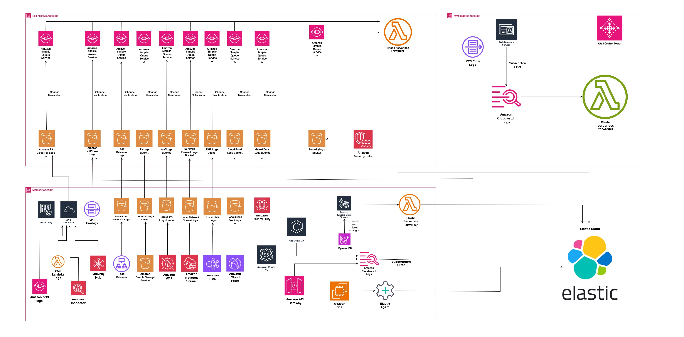
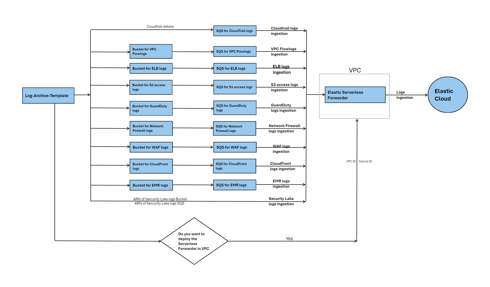
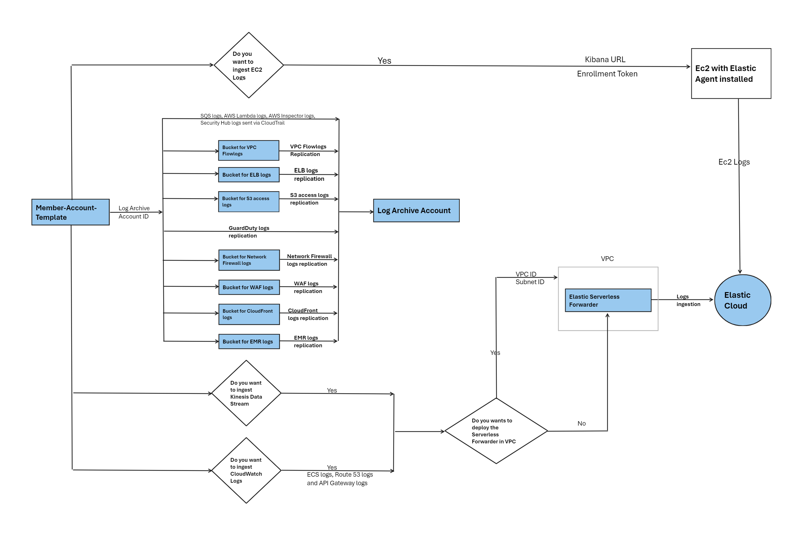
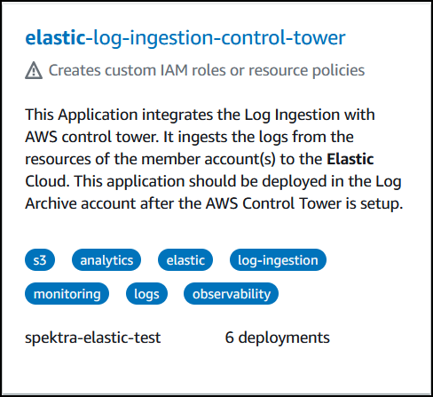
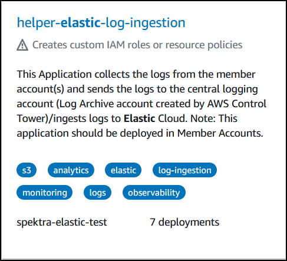

# Elastic-ingest-accelerator

<!-- TOC -->

1. [Solution Overview](#solution-overview)
2. [Architecture](#architecture)
3. [Prerequisites](#prerequisites)
4. [AWS Control Tower Overview](#aws-control-tower-overview)
5. [Deployment Overview](#deployment-overview)
6. [How Each Log Input is Collected and Sent to Elastic](#how-each-log-input-is-collected-and-sent-to-elastic)
7. [Deployment Flow](#deployment-flow)
8. [Technical details](#technical-details)
9. [Deployment Steps](#deployment-steps)

<!-- /TOC -->

## Solution Overview

Elastic is the leading platform for search-powered solutions, and help everyone — organizations, their employees, and their customers — find what they need faster, while keeping applications running smoothly, and protecting against cyber threats. Amazon Web Services (AWS) logs are collected into a central account (Log Archive account created by the AWS control Tower) in AWS and sent to Elastic Cloud. Log Ingestion to the Elastic cloud is done using the Elastic Serverless Forwarder. 

1. **Setting up the AWS Control Tower**: The first step is to set up the AWS Control Tower in your AWS account. This service will automatically set up a Log Archive account where all your AWS logs will be stored.
1. **Configuring AWS CloudTrail and AWS Config**: AWS CloudTrail is a service that records AWS API calls for your account and delivers log files to the Log Archive account. Similarly, AWS Config is a service that enables you to assess, audit, and evaluate the configurations of your AWS resources. You need to enable both these services to send logs to the Log Archive account.
1. **Setting up Elastic Cloud**: Next, you need to set up an Elastic Cloud account where the logs will eventually be sent. This platform will allow you to analyse and visualize the logs.
1. **Configuring Elastic Serverless Forwarder**: This is an AWS Lambda function that will ship your logs from AWS to Elastic Cloud. You need to configure this function with the necessary permissions and environment variables.
1. **Deploying the Application from the Serverless Application repository**: Finally, you need to deploy the solution from the Serverless Application repository in your AWS account.  This will create the necessary resources such as S3 bucket and Kinesis Data Stream, and also deploy the Elastic Serverless Forwarder. Once the application is deployed in Log Archive account and member account, check if the logs appear in Elastic Cloud.

This process will ensure that all your AWS logs are collected in a central place and can be easily analysed and visualized using Elastic Cloud.

## Architecture

The following architecture diagram outlines high-level components involved in ingesting logs from various AWS Services to Elastic Cloud.

1. **Master Account**: This is essentially the control center of the entire operation. It's where the AWS Control Tower is managed and the main point for deploying the solution. If you want to ingest directory logs to the Elastic Cloud, the Elastic Forwarder for AWS Directory services-related logs will be hosted here.
1. **Log Archive Account**: This account serves as the primary storage for logs collected from various AWS services. These logs are stored in different S3 buckets through AWS Control Tower integration. Moreover, it's where the primary Elastic Serverless Forwarder and an SQS (Simple Queue Service) are hosted. The SQS is used to notify the logs from S3 buckets into the Elastic Cloud.
1. **Member Account(s)**: These are the account(s) that host the actual AWS resources which send logs to the Log Archive account. If required, these accounts can also host the Elastic Serverless Forwarder for Kinesis Data Stream/CloudWatch logs ingestion to the Elastic Cloud. To simplify this process and reduce management overhead, AWS users can now leverage the Amazon Kinesis Firehose Delivery Stream to ingest logs into Elastic Cloud in AWS in real time and view them in the Elastic Cloud.

This architecture ensures that logs from various AWS services are efficiently collected in a central place (Log Archive Account) and then sent to the Elastic Cloud for analysis and visualization.



## Prerequisites

1. **Set up AWS Control Tower in the Master Account:**
    - This step involves setting up a multi-account environment using AWS Control Tower, which will automatically create a Log Archive account and an Audit account. The Log Archive account will have a central S3 bucket configured to collect AWS CloudTrail and AWS Config logs from all member accounts. You can find more information in the [AWS Control Tower Documentation](https://docs.aws.amazon.com/controltower/latest/userguide/what-is-control-tower.html) and [Getting started with AWS Control Tower](https://docs.aws.amazon.com/controltower/latest/userguide/getting-started-with-control-tower.html).
1. **Prepare the Networking Infrastructure (if deploying in VPC):**
    - If you plan to deploy the Elastic Serverless forwarder within an Amazon VPC, you'll need to have a VPC, subnets, and route tables created in the Log Archive account and all member accounts where the solution will be deployed.
1. **Set up an Elastic Cloud Account and Deploy a Stack on AWS:**
    - You must have an active account on Elastic Cloud and a deployed Elastic Stack on AWS. The deployment instructions can be found on Elastic's website [here](https://www.elastic.co/guide/en/elastic-stack/current/installing-elastic-stack.html). Ensure you have an Elastic Cluster deployed and note down your Elastic Cloud ID and Elastic API key, which are necessary for log ingestion.
    - Additionally, keep your AWS Organization ID and the Log Archive account's AWS account ID readily available.
1. **Ensure Adequate AWS Permissions:**
    - The AWS account you use must have the necessary permissions to pull data from various AWS services. The specific permissions required will be detailed in the [documentation](https://docs.elastic.co/en/integrations/aws#aws-permissions) provided by Elastic.
1. **Configure Log Ingestion Sources:**
    - Prior to launching the solution from the Serverless Application Repository, make sure you have the correct configurations for the AWS resources from which logs will be ingested. This includes having the ARNs (Amazon Resource Names) for the respective resources:
        - **AWS CloudTrail logs:** CloudTrail Bucket Name and Bucket ARN
        - **Amazon Security Lake logs:** Security Lake Bucket ARN and SQS ARN
        - **AWS Kinesis Data Stream:** Kinesis Data Stream ARNs
        - **AWS CloudWatch logs:** CloudWatch Log Group ARNs

Once these prerequisites are met, you can proceed with launching the application from the Serverless Application Repository, and the logs will be ingested into the Elastic Cloud.
Please ensure you review and follow any additional guidelines provided by the documentation for the services you are using, as this will help avoid common pitfalls and ensure a smoother setup process.


## AWS Control Tower Overview

AWS Control Tower is a managed service that automates the setup of a baseline environment, or landing zone, in AWS and simplifies the governance of multiple AWS accounts within an organization. The key features and components are essential for ensuring that the environment is secure, well-managed, and adheres to best practices.

To summarize and expand on the key aspects of AWS Control Tower:

1. **AWS Landing Zone**: A pre-configured setup that includes a multi-account environment with best practice blueprints. It lays the groundwork for a scalable, secure AWS environment. For the latest and more information, refer to the [AWS Landing Zone](https://docs.aws.amazon.com/prescriptive-guidance/latest/migration-aws-environment/understanding-landing-zones.html).


1. **Account Vending**: This feature automates the creation of new AWS accounts with predefined templates, ensuring they comply with the organization's policies and best practices. For the latest and more information, to refer to the [Account Factory](https://docs.aws.amazon.com/controltower/latest/userguide/account-factory.html).


1. **Multi-account Architecture**: AWS Control Tower facilitates the management of multiple AWS accounts, improving security and resource isolation. It includes a master (management) account and allows for the creation of member accounts. AWS Control Tower creates Log Archive and Audit Account which plays a crucial role in maintaining visibility and compliance across the AWS environment. For the latest and more information, to refer to the [Multi Account Setup](https://docs.aws.amazon.com/controltower/latest/userguide/aws-multi-account-landing-zone.html).


1. **Guardrails**: These are high-level policy rules that enforce governance and compliance by managing available AWS service actions across the organization. For the latest and more information, to refer to the [Controls](https://docs.aws.amazon.com/wellarchitected/latest/management-and-governance-guide/controls.html).


1. **Service Control Policies (SCPs)**: SCPs provide centralized control over the maximum available permissions for all accounts in your organization, allowing you to manage permissions across accounts. For the latest and more information, to refer to the [SCPs](https://docs.aws.amazon.com/organizations/latest/userguide/orgs_manage_policies_scps.html).

1. **Audit and Monitoring**: AWS Control Tower offers built-in logging and monitoring capabilities to track user actions and resource changes across your AWS environment, which is crucial for security and compliance. For the latest and more information, to refer to the [Logging & Monitoring](https://docs.aws.amazon.com/controltower/latest/userguide/logging-and-monitoring.html).

1. **Continuous Improvement**: The service is designed to evolve with your organization's needs, allowing you to update account templates and policies as requirements change.

1. **Integration with AWS Organizations**: AWS Control Tower is built on top of AWS Organizations, providing policy-based management for multiple AWS accounts. For the latest and more information, to refer to the [AWS Organization](https://docs.aws.amazon.com/organizations/latest/userguide/services-that-can-integrate-CTower.html).

1. **Log Archive Account**: A centralized account dedicated to storing logs from all accounts in the AWS environment, facilitating security analysis and compliance auditing.


1. **Audit Account**: A centralized account where continuous compliance checks, security assessments, and auditing are performed. It's an important component for governance and risk management.

For anyone planning to use AWS Control Tower, it's important to stay up-to-date with the latest documentation and features. AWS continuously updates its services to improve functionality and security, so checking the official AWS documentation is always recommended for the latest information and best practices.


## Implementation Guide

### Implementation Overview

To deploy a centralized log management solution using AWS Control Tower and Elastic Cloud, you should follow a staged approach to ensure proper setup and integration between your AWS accounts and Elastic Cloud. The core application must be deployed in the Log Archive account created by AWS Control Tower to collect the logs from various AWS resources and forward them to Elastic Cloud. The helper application must be deployed in the customer member account(s) which are part of the AWS Organization so it can collect logs locally and send the logs to the central logging account (Log Archive account created by AWS Control Tower)/ingests logs to Elastic Cloud. Note that this helper application should be deployed in member account(s) after the core application is deployed in the Log Archive account . We have considered the following inputs for log ingestion 

- AWS CloudTrail logs
- Amazon S3 Access logs
- Amazon ELB logs
- Amazon VPC Flow logs
- AWS Kinesis Data Stream
- AWS CloudWatch logs
- AWS GuardDuty logs
- Amazon Ec2 logs
- AWS Network Firewall logs
- Amazon WAF logs
- Amazon CloudFront logs
- Amazon EMR Cluster logs
- Amazon Security Lake logs
- AWS SQS Management Event logs via CloudTrail
- AWS Lambda logs via CloudTrail
- AWS Inspector logs via CloudTrail
- Security Hub logs via CloudTrail
- Amazon Elastic Container Service logs via CloudWatch
- Amazon Route 53 logs via CloudWatch
- Amazon API Gateway logs via CloudWatch


The applications will be deploying the solution as per the resources deployed in the member account and user requirements of the logs that are to be ingested into the Elastic Cloud. The core application will deploy resources in the Log-Archive account and then the helper application will deploy the required resources in the member account. You can use Amazon Kinesis Firehose Delivery Stream to directly ingest logs into Elastic Cloud. The following log ingestion is supported by the Amazon Kinesis Firehose Delivery Stream

- AWS CloudFront logs
- EC2 logs in AWS CloudWatch
- Amazon Elastic Load Balancing logs
- AWS Network Firewall logs
- Amazon Route 53 logs
- Amazon S3 server access log
- AWS VPC flow logs
- AWS WAF Logs

## How Each Log Input is Collected and Sent to Elastic

Each log input is collected and sent to Elastic using different mechanisms and services in AWS. Here is a summary of how each log input is collected and sent to Elastic:

### AWS CloudTrail

CloudTrail logs are collected from all accounts and regions and stored in a central S3 bucket in the Log Archive account. Elastic pulls these logs using an SQS-based S3 input mechanism from the S3 bucket.

### S3 Access Logs

S3 access logs are collected locally in each region and replicated to the central S3 log bucket in the Log-Archive account. The logs are sent to Elastic using the Elastic Serverless Forwarder via SQS.

### Amazon ELB logs

The ELB logs are collected locally in each region and replicated to the central S3 log bucketin the Log-Archive account. Logs are sent to Elastic using the Elastic Serverless Forwarder via SQS.

### Amazon VPC Flow logs

Amazon VPC Flow logs can be sent directly to the central S3 log bucket in the Log Archive account. Amazon VPC Flow logs generate a lot of log data, so we don’t recommend that you generate them from each account and each region. The logs from the S3 bucket in the log archive account are sent to the Elastic Serverless forwarder via the SQS.

### AWS Kinesis Data Stream

The item level changes in the DynamoDB are sent to Amazon Kinesis Data Stream. The Kinesis Data Stream’s ARN is provided to the Elastic Serverless Forwarder. Elastic Serverless Forwarder, an AWS Lambda function facilitating the transfer of data from Kinesis Data Stream to Elastic Cloud.

### AWS CloudWatch logs

CloudWatch logs areb subscribed by a subscriber Lambda function and sent to Elastic Cloud using the Elastic Serverless Forwarder.

### Amazon GuardDuty Findings

GuardDuty supports exporting active findings to CloudWatch Events and, optionally, to an S3 bucket. The new active findings that GuardDuty generates are automatically exported within about five minutes after the finding is generated. You can set the frequency for how often updated active findings are exported to CloudWatch Events and your S3 bucket. The frequency that you select applies to exporting to both CloudWatch Events and your S3 bucket, but only for updated findings. The findings are exported every six hours to a central S3 bucket in the Log-Archive account. The logs from the S3 bucket in the log archive account are sent to the Elastic Serverless forwarder via the SQS.

### Amazon Ec2 logs

For the EC2 logs to be injected to the Elastic Cloud, you need an EC2 instance with elastic agent installed in it. The CFT will deploy an EC2 instance & you have to provide the Kibanna URL & Authentication token. The bash script will take care of installation of elastic agent in the EC2 instance deployed & will automatically list this agent in the Kibanna fleet. For fetching the logs from other EC2 instance in the elastic cloud, you would have to send the syslogs from the source instance to the EC2 instance where the elastic agent is running & you would be able to view the logs in elastic cloud for the source instance.

### AWS Network Firewall logs

Network Firewall generates log file or log stream generally contains information about the requests that your firewall received during a given time period. The alert and flow logs collect log records, consolidate them into log files, and then publish the log files to the Amazon S3 bucket at 5-minute intervals. Each log file contains log records for the network traffic recorded in the previous five minutes. These log files are collected in a local S3 bucket in the member account. The log files are then replicated to a S3 bucket in the Log Archive account. Amazon SQS is configured to trigger the Elastic Serverless forwarder, an AWS Lambda function that ships logs to Elastic Cloud.

### Amazon WAF logs

Amazon WAF supports collecting and analyzing WAF logs that provide information about requests aligning with defined rules. Configuration involves directing WAF logs locally to an S3 bucket in the member account. Additionally, replication is established to duplicate logs to another S3 bucket in a Log Archive account. The process also incorporates Elastic Serverless Forwarder, an AWS Lambda function facilitating the transfer of data from S3 bucket to Elastic Cloud. 

### Amazon CloudFront logs

CloudFront generates standard log file or real-time log stream that contains information about the requests that your distribution received during a given time period. The standard logs collect log records, consolidate them into log files, and then deliver the log files to the Amazon S3 bucket at regular intervals. Each log file contains log records for the user requests recorded in the previous time period. These log files are stored in the S3 bucket in the member account which is specified when logging is enabled. The log files are  then replicated to a S3 bucket in the Log Archive account. Amazon SQS is configured to trigger the Elastic Serverless forwarder, an AWS Lambda function that ships logs to Elastic Cloud. 

### Amazon EMR Cluster logs

Amazon EMR produce log files that report status on the cluster. Amazon EMR supports archiving log files to S3 bucket. When Amazon EMR is configured to archive log files to Amazon S3, it stores the files in the S3 location specified, in the /cluster-id/ folder, where cluster-id is the cluster ID. These log files are collected locally in a S3 bucket in the member account. The log files are  then replicated to a S3 bucket in the Log Archive account. Amazon SQS is configured to trigger the Elastic Serverless forwarder, an AWS Lambda function that ships logs to Elastic. 

### Amazon Security Lake Findings

Security Lake supports aggregating and normalizing findings from sources into a purpose-built data lake stored in your AWS account. The new findings that Security Lake collects are automatically transformed into a standard open-source schema called the Open Cybersecurity Schema Framework (OCSF) within about five minutes after the finding is collected. You can set the retention and replication settings for how long and where your findings are stored in your S3 buckets. The settings that you select apply to both your original and OCSF-formatted findings. The findings are aggregated into one or more rollup Regions, making it easier to monitor and report on compliance. The Security Lake findings are stored in your Security Lake primary account. Security lake findings are collected in a S3 bucket. Amazon SQS is configured to trigger Elastic Serverless Forwarder, an AWS Lambda function that ships logs to Elastic. The Elastic Serverless Forwarder is triggered by the SQS queue and can forward data to Elastic Cloud.

### AWS SQS Management Event logs

CloudTrail can be configured to log the data events for the Amazon SQS. The CloudTrail logs are stored in a central S3 bucket in Log-Archive account. Elastic pulls these logs using an SQS-based S3 input mechanism. New object notifications are sent to SQS. These logs are ingested from the S3 bucket to the Elastic Cloud using Elastic Serverless Forwarder.

### AWS Lambda logs

CloudTrail can be configured to log the management event and data event logs for the AWS Lambda service. The CloudTrail logs are stored in a central S3 bucket in Log-Archive account. Elastic pulls these logs using an SQS-based S3 input mechanism. New object notifications are sent to SQS. These logs are ingested from the S3 bucket to the Elastic Cloud using Elastic Serverless Forwarder.

### AWS Inspector logs

All the activities generated by Amazon Inspector are recorded as events in CloudTrail event. The CloudTrail logs are stored in a central S3 bucket in Log-Archive account. Elastic pulls these logs using an SQS-based S3 input mechanism. New object notifications are sent to SQS. These logs are ingested from the S3 bucket to the Elastic Cloud using Elastic Serverless Forwarder. 

### Security Hub logs

Security Hub management event logs are recorded in CloudTrail event. The CloudTrail logs are stored in a central S3 bucket in Log-Archive account. Elastic pulls these logs using an SQS-based S3 input mechanism. New object notifications are sent to SQS. These logs are ingested from the S3 bucket to the Elastic Cloud using Elastic Serverless Forwarder.

### Amazon Elastic Container Service logs

Amazon Elastic Container Service can forward logs to a CloudWatch Log Group. The Log Group ARN is then used as input for the Elastic Serverless Forwarder, enabling the creation of a subscription filter to send the logs to Elastic.

### Amazon Route 53 logs

Route 53, is a scalable and highly available DNS service, which supports monitoring and analyzing DNS queries directed to domain names handled by Route 53. To achieve this, query logging is enabled for hosted zones, and a CloudWatch log group is specified to store the query logs. These logs encompass details such as DNS name, request type, response code, and source IP address. Additionally, Elastic Serverless Forwarder, an AWS Lambda function, is utilized to forward data from CloudWatch log groups to Elastic Cloud. The CloudWatch log group's ARN is provided as an input parameter to the Elastic Serverless Forwarder, facilitating the transmission of query logs to Elastic Cloud.

### Amazon API Gateway logs

We can configure CloudWatch Logs to record API calls for the Amazon API Gateway service. The CloudWatch Log Group ARN is then provided as input to the Elastic Serverless Forwarder, which creates a subscription filter to send the logs to Elastic.

### Ingesting logs using Amazon Kinesis Firehose

To simplify the process and reduce management overhead, AWS users can now leverage the Amazon Kinesis Firehose Delivery Stream to ingest logs into Elastic Cloud in AWS in real time and view them in the Elastic Stack alongside other logs for centralized analytics. Elastic has collaborated with AWS to offer a seamless integration of Amazon Kinesis Data Firehose with Elastic, enabling direct ingestion of data from Amazon Kinesis Data Firehose into Elastic without the need for Agents or Beats. All you need to do is configure the Amazon Kinesis Data Firehose delivery stream to send its data to Elastic's endpoint.

For example to send the VPC Flow logs to Elastic using Kinesis Firehose, you need to configure VPC Flow Logs to send to Amazon Kinesis Data Firehose. Create a "Flow Log" for the VPC and select the Kinesis Firehose delivery stream name (which is deployed by the application) in the same member account to which the flow logs will be published. Similarly you can configure AWS Network Firewall logs, AWS CloudFront logs, EC2 logs in AWS CloudWatch, Amazon Elastic Load Balancing logs, Amazon Route 53 logs, Amazon S3 server access log and AWS WAF Logs to send to Amazon Kinesis Data Firehose.


These mechanisms and services ensure that each log input is collected and sent to Elastic for analysis and storage.

## Deployment Flow

The core application and the helper application deploys the required resources in the Log archive account and the member account(s). Following diagram shows the deployment flow of the CFT in the Log archive account.



Following diagram shows the deployment flow of the CFT in the member account.



## Technical details

### AWS Bootstrap Lambda

AWS Lambda is a compute service that lets you run code without provisioning or managing servers. Lambda runs your code on a high-availability compute infrastructure and performs all of the administration of the compute resources, including server and operating system maintenance, capacity provisioning and automatic scaling, and logging. With Lambda, all you need to do is supply your code in one of the language runtimes that Lambda supports. For more information, refer [AWS Lambda Documentation](https://docs.aws.amazon.com/lambda/latest/dg/welcome.html).


### Elastic Bootstrap Lambda Function

The primary purpose of this Elastic Bootstrap Lambda function is to configure an S3 bucket event notification for the CloudTrail Logs S3 bucket created by AWS Control Tower in the Log Archive Account. Additionally, it generates a configuration file (config.yml) and uploads it to an S3 bucket created by a CloudFormation Template (CFT) specifically designed to store the config.yml object.

Here is how the Elastic Bootstrap Lambda function works:

1. The Lambda function requires several parameters, including the ARN of the SQS queues to configure in the config.yml file, the S3 bucket name where the config.yml file will be uploaded, the name of the CloudTrail S3 bucket created by AWS Control Tower, and the ARN of the Elastic secret to be included in the config.yml file.

1. After deploying the CloudFormation Template (CFT), required values are provided to the Bootstrap Lambda function as environment variables. The custom resource defined in the template then triggers the execution of this function.

1. During execution, the Lambda function retrieves the name of the CloudTrail S3 bucket created by AWS Control Tower and the SQS queue ARN. Subsequently, it configures event notifications for the CloudTrail bucket to send notifications to the SQS queue whenever a new object is uploaded to the bucket.

1. The code incorporates logic to dynamically generate the config.yml file, updating property values based on the provided SQS queue and secret passed as environment variables to the Bootstrap Lambda function.

1. Refer the generated sample of config.yml file content.

    ```
    inputs:
    - type: "s3-sqs"
        id: "arn:aws:sqs:us-east-1:XXXXXXXXXXXX:Elastic-SQS-ElbLogs"
        outputs:
        - type: "elasticsearch"
        args:
            cloud_id: "arn:aws:secretsmanager:us-east-1:XXXXXXXXXXXX:secret:ElasticCloudSecret-StackSet-SC-XXXXXXXXXXXX-pp-uh66tynxmmhx6-7f7d34b5-5147-4897-bbcb-52ad25757d4b-NYsdnV:ElasticCloudID"
            api_key: "arn:aws:secretsmanager:us-east-1:XXXXXXXXXXXX:secret:ElasticCloudSecret-StackSet-SC-XXXXXXXXXXXX-pp-uh66tynxmmhx6-7f7d34b5-5147-4897-bbcb-52ad25757d4b-NYsdnV:APIKey"
    ```

Upon successful execution of the Bootstrap Lambda code, it configures event notifications for the CloudTrail logs S3 bucket, generates the config.yml file, and uploads the file to an S3 bucket.

In the Log Archive account, the core application will be deploying the following resources.

- S3 buckets to collect the S3 access logs from the member accounts
- S3 buckets to collect the Elastic Load Balancer logs from the member accounts
- S3 bucket to collect the VPC Flow logs from the member accounts
- S3 bucket to collect the Network Firewall logs from the member accounts
- S3 bucket to collect the WAF logs from the member accounts
- S3 bucket to collect the CloudFront logs from the member accounts
- S3 bucket to collect the EMR logs from the member accounts
- SQS Queue to notify Elastic Serverless Forwarder for VPC Flow Logs, Elastic Load Balancer logs, CloudTrail logs, S3 Access logs, Network Firewall logs, EMR logs, WAF logs, and CloudFront from the respective S3 buckets. Seperate SQS Queue is created for the logs from these buckets.
- Policies for the S3 buckets and the SQS Queues.
- KMS key to encrypt the SQS queue messages
- Elastic Serverless Forwarder to ingest the logs to Elastic Cloud.
- S3 bucket for storing the config.yaml file required for Elastic integration
- Bootstrap lambda function which will run a Python script to create config file required for elastic integration and upload the file to S3 bucket
- Policies for the S3 bucket (used for storing the config.yaml file) and Role and policy for bootstrap lambda.
- The Elastic ID and the API key is encrypted using the Secret Manager.
 
In the Member account, the helper application will be deploying the following resources.

- S3 buckets to store the VPC flow logs, S3 access logs, CloudTrail logs, S3 Access logs, Network Firewall logs, EMR logs, WAF logs, and CloudFront. These logs will be replicated to the buckets in the log archive account.
- Policies for the S3 buckets
- If the user wants to either ingest Kinesis Data Streams or Amazon Cloudwatch logs to Elastic Cloud, then an Elastic Serverless Forwarder will be deployed to ingest the Kinesis Data Stream/Amazon Cloudwatch logs to Elastic Cloud as per requirement. Please note that in this case the Kinesis Data Stream/Amazon Cloudwatch should be deployed in the member account as per the requirement.
- S3 bucket for storing the cofig.yaml file. 
- Bootstrap Lambda function which will run a Python script to create config.yaml file required for elastic integration and upload the file to S3 bucket.
- Policies for the S3 bucket (used for storing the config.yaml file) and Role and policy for bootstrap lambda.

## Deployment Steps:

We have published 2 applications in the Serverless Application repository. Following are the applications that are published as part of the solution.

- elastic-log-ingestion-control-tower - This is the core application that is to be deployed in the log archive account and it deploys all the required resources in the log archive account.
- helper-elastic-log-ingestion - This is the helper application which is to be deployed in the member account(s) after the deployment of the core application in the log archive account. This application deploys all the required resources to collects the logs from the member account(s) and sends the logs to the central logging bucket in the log archive account. Please note that this helper application should be deployed only after the core application is deployed successfully.

1. Log into the AWS Log Archive account.

1. Go to ***Serverless Application Repository***. In the serverless application repository, search and click on application ***elastic-log-ingestion-control-tower***.

    

1. Once you click the application, scroll down in the application page and fill the application settings as mentioned below. Once the required information is provided under application settings, you are ready to deploy the application.
   
   3.1 Application name: The stack name of this application created via AWS CloudFormation. You can leave the value as default.
   
   3.2 CloudTrail Bucket Name: Name of the AWS Control Tower created CloudTrail S3 bucket present in Log Archive Account

   3.3 CloudTrail Bucket ARN: ARN of the AWS Control Tower created CloudTrail S3 bucket present in Log Archive Account

   3.4 Security Lake Bucket ARN: ARN of the Security Lake S3 bucket present in Log Archive Account

   3.5 Security Lake SQS ARN: ARN of the Security Lake SQS present in Log Archive Account
   
   3.6 Elastic Cloud ID: Cloud ID of Elastic Cluster Deployment
   
   3.7 Elastic API Key: RESTful API to provide access to deployment CRUD actions

   3.8 AWS Organization ID: The ID of your AWS Organization.

   3.9 Deploy Serverless Forwarder In VPC: Select 'yes' if you want to deploy the Elastic Serverless Forwarder in VPC. This is an optional parameter.

   3.10 VPC ID: Enter the VPC ID in which you want to deploy the Elastic Serverless Forwarder. Provide value only if you have selected 'yes' for the parameter ***Deploy Serverless Forwarder In VPC***.

   3.11 Subnet IDs: Enter the Subnet IDs (comma-separated) for the Elastic Serverless Forwarder. Provide value only if you have selected 'yes' for the parameter ***Deploy Serverless Forwarder In VPC***.

   3.12 Route Table IDs: Specify the IDs of the route tables to be updated for the S3 bucket Gateway VPC Endpoint. Provide values only if you have selected 'yes' for the parameter ***Deploy Serverless Forwarder In VPC***.

   3.13 Check the option for acknoledgement that this app creates custom IAM roles, resource policies and deploys nested applications and click on ***Deploy***.

1. Wait for the deployment of the application and check if all the resources are successfully deployed as per the requirement.

1. Log into the member account.

1. Go to ***Serverless Application Repository***. In the serverless application repository, search and click on application ***helper-elastic-log-ingestion***.

    

1. Before deploying this helper application, please make sure that the core application is successfully deployed in the Log Archive account. Once you click the helper application, scroll down in the application page and fill the application settings as mentioned below. Once the required information is provided under application settings, you are ready to deploy the application.

   7.1 Application name: The stack name of this application created via AWS CloudFormation. You can leave the value as default.

   7.2 Account ID: AWS Account Id of the log-archive account

   7.3 Logging Region: What region are the log buckets deployed in? Region of the central logging bucket created in the Log archive account.

   7.4 Elastic Cloud ID: Cloud ID of Elastic Cluster Deployment

   7.5 Elastic API Key: RESTful API to provide access to deployment CRUD actions

   7.6 Ingest Kinesis Logs: Select 'yes' if you want to ingest Kinesis data streams. This is an optional parameter.

   7.7 Kinesis Data Stream ARNs: Comma-delimited list of Kinesis Data Stream ARNs. Provide value only if you have selected 'yes' for the parameter ***Ingest Kinesis Logs***.

   7.8 Ingest CloudWatch Logs: Select 'yes' if you want to ingest CloudWatch Log Group logs. This is an optional parameter.

   7.9 CloudWatch LogGroup ARNs: Comma-delimited list of CloudWatch Log Group ARNs. Provide value only if you have selected 'yes' for the parameter ***Ingest CloudWatch Logs***.

   7.10 Deploy Serverless Forwarder In VPC: If you want to ingest either Kinesis data Streams or the CloudWatch logs to Elastic Cloud, an Elastic Serverless Forwarder will be deployed. Select 'yes' if you want to deploy this Elastic Serverless Forwarder in VPC. This is an optional parameter.

   7.11 VPC ID: Enter the VPC ID in which you want to deploy the Elastic Serverless Forwarder. Provide value only if you have selected 'yes' for the parameter ***Deploy Serverless Forwarder In VPC***.

   7.12 Subnet IDs: Enter the Subnet IDs (comma-separated) for the Elastic Serverless Forwarder. Provide value only if you have selected 'yes' for the parameter ***Deploy Serverless Forwarder In VPC***.

   7.13 Route Table IDs: Specify the IDs of the route tables to be updated for the S3 bucket Gateway VPC Endpoint. Provide values only if you have selected 'yes' for the parameter ***Deploy Serverless Forwarder In VPC***.
   
   7.14 Ingest Ec2 logs: Select 'yes' if you want to ingest Ec2 logs. This is an optional parameter.

   7.15 Kibana URL: Provide the Kibana URL only if you have selected 'yes' for the parameter ***Ingest Ec2 Logs***.

   7.16 Elasticsearch Username: Specify the username for accessing the Elasticsearch deployment.

   7.17 Elasticsearch Password: Specify the password for accessing the Elasticsearch deployment.

   7.18 ElasticSearch DeploymentID: Specify the unique Deployment ID associated with your Elasticsearch deployment.

   7.19 Deployment Version: Specify the version of the Elasticsearch deployment

   7.20 Enable Kinesis Firehose Ingestion: Specify whether you want to ingest logs to Elastic Cloud using Amazon Kinesis Firehose Delivery Stream. Choose 'Yes' to enable ingestion via Kinesis Firehose, or 'No' to ingest logs via a different method.

   7.21 Elasticsearch Endpoint URL: Specify the endpoint URL of your Elastic deployment. This is the URL where your Elastic services are hosted. Note: Ensure this value is entered accurately to enable proper integration with your Elastic deployment. Provide value only if you have selected 'yes' for the parameter ***Enable Kinesis Firehose Ingestion***.

   7.22 Check the option for acknoledgement that this app creates custom IAM roles, resource policies and deploys nested applications and click on ***Deploy***.

7. Once the deployment of the helper application is completed, log into the Elastic dashboard to view the logs ingested.